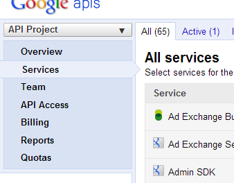
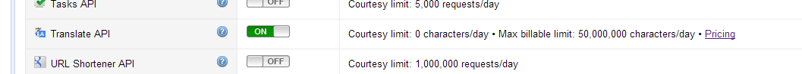
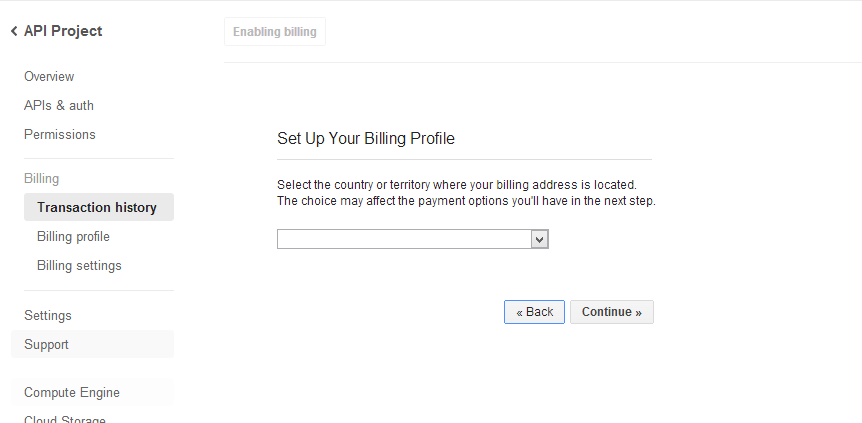
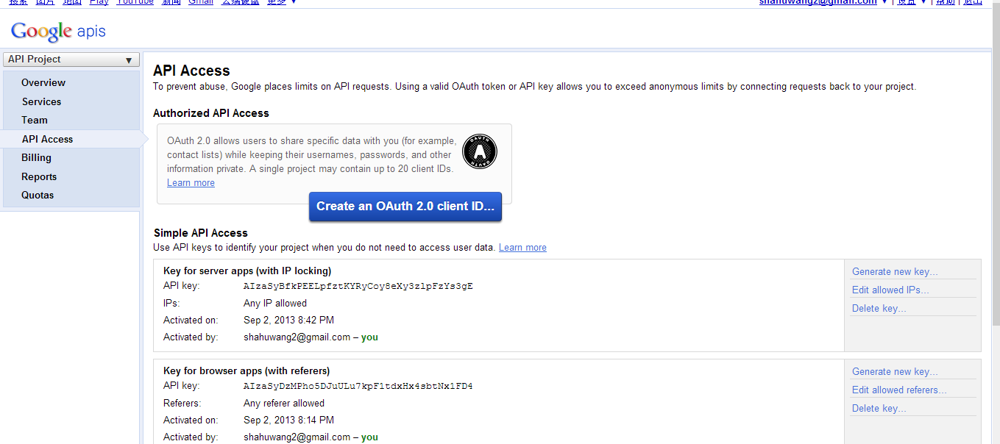

## Google Translate API使用

#### 如何购买
+ 用你的谷歌账号登录 [API Console](https://code.google.com/apis/console)
+ 如下图，选择左侧的services面板

      
+ 右侧选项，在底部找到Translate API，开启  
    

+ 点击左侧的Billing面板，进入到付费流程。这里会要求填写一大堆的个人信息和信用卡信息。我没有填完，但是应该是填完之后，会列出你要购买的服务，然后选择付费。
    
+ 付费完毕，进入API Access面板，如下图，会列出你所购买服务的API所需要的key（这里没有付费，所以只有免费应用可用key）
   

+ 如上图所示，为了更加安全，有两种方式，一个是使用OAuth，一个是指定IP访问
+ 调用翻译API的方法很简单，可参考[此处](https://developers.google.com/translate/v2/using_rest#auth)。直接用Get方法访问URL就可以，URL形式如下：
https://www.googleapis.com/language/translate/v2?key=INSERT-YOUR-KEY&source=en&target=de&q=Hello%20world

+ 计费情况：
  1. $20 per 1 M characters of text
  2. 每天默认最大可用 2 M。但是可以提高到 50 M每天的限制，具体调整可以看 [Quota](https://code.google.com/apis/console/#project:838111072318:quotas)
  3. 字节的计算方式：translating 您好 into “hello” is charged as 2 characters, whereas translating “hello” into 您好 is charged as 5 characters。
  