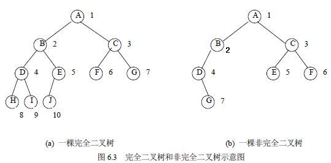
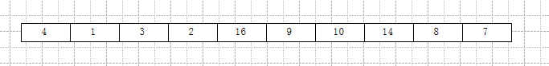
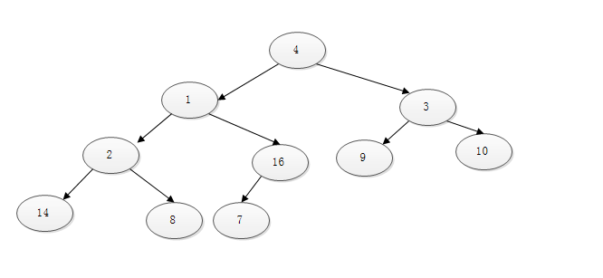
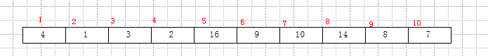
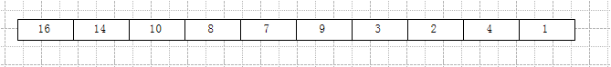
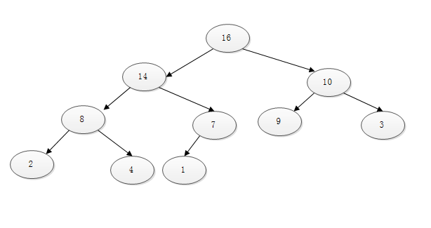

##  Go语言之堆结构

很多时候，人是否聪明，似乎真的不是智商决定的，而是态度决定的，是畏难、浮躁等态度和情绪，让人变笨的。大二学数据结构，我连二叉树都实现不了，我总觉得那很难很难，总是觉得自己学不了。后面断断续续学习数据结构和算法，每次到了树结构之后，我都坚持不下去。

记得数据结构这门课挂了之后，我还打了个电话给任课老师，确认一下是否有错。当时那个老师就问了句：“每次看你上课都那么认真，怎么考得这么差？”实际上当时我的编码能力在全班已经算是最好的几个之一了，只是我自己在态度上的畏难、浮躁等因素，而导致我没能把数据结构学下去。

大学很多很多的课程都是如此，程序设计学C++，数据库，计算机系统，网络基础等等这些课程，我总是先以畏难的情绪去面对，遇到点难度，就怀疑自己，埋怨课程难度太高了。但实际上，当我真正克服了这些想法之后，这些课程对于我来说变得很简单很简单。

只要克服畏难、浮躁等情绪，很多的东西都会变得很简单很简单的，譬如今天要写的堆。之前我一直觉得这是个非常复杂的东西，可实际上，代码实现出来，也就几十行的量。

在微博上，也遇到和我一样的人，很多人都在强调数据结构和算法的重要性，我也知道，但是很多算法和数据结构，实现了之后，过一段时间我就会忘了，那学习的意义到底是什么呢？后来我想了想，意义很多呀。首先，第一个就是没有了畏难情绪，因为我之前实现过，我现在肯定也行。第二个是学习完之后，脑子会自动建立许多知识的索引，多了就能自动关联形成知识推理了。第三，有了索引，其实我们只要提示一下，还是能很快做出来的。

废话扯多了，下面开始步入正题吧。

首先，堆是一种特殊的数据结构，一般有三种，最小堆、最大堆或者最大最小堆。

第二，堆是完全二叉树，只不过节点的数值是有规律的。所以，在学习堆之前，先来学习一下完全二叉树的基本知识。

完全二叉树，看网上的说法，据说还没有完整的唯一定义。国内接受比较多的定义：
> 若设二叉树的深度为h，除第 h 层外，其它各层 (1～h-1) 的结点数都达到最大个数，第 h 层所有的结点都连续集中在最左边，这就是完全二叉树

大致如下图：

完全二叉树有什么优势呢？其通过简单的数学计算就能很快得出许多特性，涉及比较多，这里主要介绍与堆有关的几个。

由于完全二叉树的特性，节点的存储选用数组而不是链表，这样能够极快的提供访问数据，因为根据节点的下标，就能获得其父节点，左右子节点是谁，因此用数组更加快捷。如下图所示数组，可以用其表示一颗完全二叉树：

其对应 的完全二叉树如下图：

先给数组标个位置，如下图：

从左向右，从1开始标起。
完全二叉树的数组特性如下：

1. 奇数位都是右节点（根除外），偶数位都为左节点，如位置2，值为1，左节点。
2. 位置 ***i*** 的父节点是 [***i***/2] ,[] 表示取比里面值小的最大整数，如2.5取2.
3. 位置 ***i*** 的左子节点是位置 ***i*** * 2，右子节点是位置 ***i*** * 2+1
4. 设节点总数为n，则n/2+1 及以后位置的节点，均为叶节点。而之前的节点，都不是叶节点。

位置 ***i*** 的概念比较重要，因为后面的代码实现均使用位置，而不是数组的索引。
 
了解了完全二叉树的重要概念之后，现在要来看看什么是堆，或者说二叉堆。其定义如下：
> 堆是完全二叉树的一种，父节点的键值总是大于（等于）或小于（等于）任意一个子节点的键值。而每个节点的左右子树亦如是，即子树也是二叉堆。

最大堆就是父节点比子节点大。最小堆就是父节点比子节点小。最大最小堆比较复杂，暂时没去了解。
上面那个数组，变成最大堆之后如下：

二叉树结构变成如下形式：

可以看到，父节点总是比子节点大的。但要注意，此时的数组并未排好序，只能确定第一个元素是最大的而已。

现在开始定义最大堆的数据结构，我的很简单，就是下面的结构体：

    type HeapTree struct {
	   Values []int //存放所有的节点
    }

最难的是构建最大堆的过程。首先，用户输入一组数据，而构建的过程就是要把这组数据变成符合最大堆规则的数组形式。用户输入的数组可以看成是一个普通的完全二叉树，而我们要做的，就是调整每一个父节点，使其满足父节点比子节点都大的最大堆要求，这就是最大堆构建过程中要做的事情。

根据完全二叉树的特点，我们知道那些位置的数据是作为父节点存在的，如下图：

如上，1,2,3,4,5这五个位置的数据都是做父节点的，其他的都是叶结点，所以我们从位置5开始向左调整就可以了。

调整的过程，分两步，第一步是找出父节点，左右子节点中最大的，把最大的放到父节点的位置。第二步，由于第一步的调整，左右子树的堆特性可能已经被破坏，所以需要递归调整左右子树。

如下图：

我们先调整16和2这一层，然后调整1,3这一层，最后调整最高层。

构建代码如下：

    func (tree *HeapTree) Build(datas []int) *HeapTree {
    	var a []int
    	for i := len(datas) / 2; i > 0; i-- {
    		a = tree.maxHeapfify(datas, i, len(datas))
    	}
    	tree.Values = a
    	return tree
    }

    func (tree *HeapTree) maxHeapfify(datas []int, i int, heapsize int) []int {
	  left := i * 2
	  right := i*2 + 1
	  maxIndex := i
	  if left <= heapsize && datas[left-1] > datas[maxIndex-1] {
		maxIndex = left
	  }
	  if right <= heapsize && datas[right-1] > datas[maxIndex-1] {
		maxIndex = right
	  }
	  if maxIndex != i {
		tmp := datas[i-1]
		datas[i-1] = datas[maxIndex-1]
		datas[maxIndex-1] = tmp

		//根与左子节点或者右子节点的值交换了，此时子树可能不符合堆性质
		//因此，要对子树递归同样处理
		tree.maxHeapfify(datas, maxIndex, heapsize)
	  }
	  return datas
    }

这里比较难的就是maxHeapfify这个方法了，它就是针对某个位置调整及递归调整的。第一个参数是数组，第二个参数是要调整的位置，记住是数组我上面标的那些位置。heapsize树的节点总数。先找出最大值，然后把最大值放到父节点上去。对子树进行递归处理。

第二个比较难的是添加新数据。首先，添加的新数据都放到数组的最后去，然后让这个新增的数据上浮调整，直到找到它该呆的位置，同时新的树满足最大堆规则。先上代码：

    func (tree *HeapTree) Add(data int) *HeapTree {
    	datas := tree.Values
    	datas = append(datas, data)
    	size := len(datas)
    	datas = tree.heapup(datas, size)
    	tree.Values = datas
    	return tree
    }
    func (tree *HeapTree) heapup(datas []int, index int) []int {
    	if index > 1 {
    		parent := index / 2
    
    		parentValue := datas[parent-1]
    		indexValue := datas[index-1]
    		if parentValue < indexValue {
    			tmp := datas[parent-1]
    			datas[parent-1] = datas[index-1]
    			datas[index-1] = tmp
    			tree.heapup(datas, parent)
    		} else {
    			//没有发生交换，说明新增的数据已经找到它的位置了
    			return datas
    		}
    	}
    
    	return datas
    }

注意，heapup的index参数是指调整的数据的位置，就是我标的那些位置。heapup做的事情是这样的：
传入参数是一个数组，以及一个位置，这个位置就是要进行上浮调整的数据。这里开始的时候是最后一个数据。然后和这个数据的父节点进行比较，如比父节点大，则进行上浮，与父节点进行交换。这一交换，就有新的问题要面对了，就是新父节点的父节点之间，可能已经不满足最大堆特性了，因此开始从新的父节点继续上浮调整。如果没有发生交换，说明已经找到位置了，返回调整好的数组。

现在剩下的最后一个难点是堆排序了。这里是将最大堆排列为一个升序的数组输出。堆排序要做的就三步：

1. 取出根元素，也就是数组的第一个元素，与数组的最后一个元素交换。此时最大值已经取出。
2. 最大堆数组变成[0,1....n-2],就是说，堆数组此时不包括原有堆数组的最后一个元素
3. 对新的子数组进行堆构建，重复第一步

代码如下：

    func (tree *HeapTree) Sort() []int {
    	size := len(tree.Values)
    	for i := size; i >= 1; i-- {
    		tmp := tree.Values[i-1]
    		tree.Values[i-1] = tree.Values[0]
    		tree.Values[0] = tmp
    
    		tree.Values = tree.maxHeapfify(tree.Values, 1, i-1)
    
    	}
    	return tree.Values
    
    }

从上面可以看出，循环里面，先是交换第一个和最后一个元素的值，把最大值放到后面，逐渐形成排序效果。记住，所有的操作都是对同一个数组，只不过数组左侧依旧还是作为最大堆数组，而右侧则存放所有已排序的数据。这样循环下去，所有数据就都排好序了。

完整代码如下：

    // minheap
    package heap
    
    type HeapTree struct {
    	Values []int //存放所有的节点
    }
    
    func (tree *HeapTree) Delete() {
    	//删除根节点
    	datas := tree.Values[1:]
    	tree.Build(datas)
    }
    func (tree *HeapTree) Sort() []int {
    	size := len(tree.Values)
    	for i := size; i >= 1; i-- {
    		tmp := tree.Values[i-1]
    		tree.Values[i-1] = tree.Values[0]
    		tree.Values[0] = tmp
    
    		tree.Values = tree.maxHeapfify(tree.Values, 1, i-1)
    
    	}
    	return tree.Values
    
    }
    func (tree *HeapTree) Build(datas []int) *HeapTree {
    	var a []int
    	for i := len(datas) / 2; i > 0; i-- {
    		a = tree.maxHeapfify(datas, i, len(datas))
    	}
    	tree.Values = a
    	return tree
    }
    
    func (tree *HeapTree) Add(data int) *HeapTree {
    	datas := tree.Values
    	datas = append(datas, data)
    	size := len(datas)
    	datas = tree.heapup(datas, size)
    	tree.Values = datas
    	return tree
    }
    func (tree *HeapTree) heapup(datas []int, index int) []int {
    	if index > 1 {
    		parent := index / 2
    
    		parentValue := datas[parent-1]
    		indexValue := datas[index-1]
    		if parentValue < indexValue {
    			tmp := datas[parent-1]
    			datas[parent-1] = datas[index-1]
    			datas[index-1] = tmp
    			tree.heapup(datas, parent)
    		} else {
    			//没有发生交换，说明新增的数据已经找到它的位置了
    			return datas
    		}
    	}
    
    	return datas
    }
    func (tree *HeapTree) maxHeapfify(datas []int, i int, heapsize int) []int {
    	left := i * 2
    	right := i*2 + 1
    	maxIndex := i
    	if left <= heapsize && datas[left-1] > datas[maxIndex-1] {
    		maxIndex = left
    	}
    	if right <= heapsize && datas[right-1] > datas[maxIndex-1] {
    		maxIndex = right
    	}
    	if maxIndex != i {
    		tmp := datas[i-1]
    		datas[i-1] = datas[maxIndex-1]
    		datas[maxIndex-1] = tmp
    
    		//根与左子节点或者右子节点的值交换了，此时子树可能不符合堆性质
    		//因此，要对子树递归同样处理
    		tree.maxHeapfify(datas, maxIndex, heapsize)
    	}
    	return datas
    }
    
    
