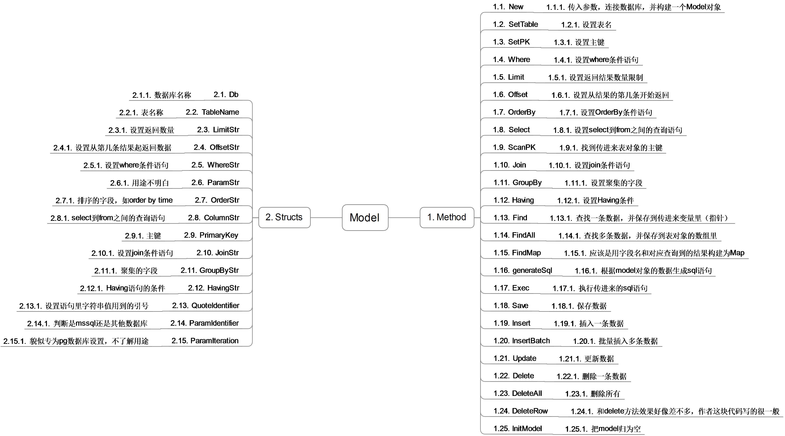

## Go语言学习之beedb源代码阅读

最近有一个明显的感觉，我已经过了需要阅读书籍教程学习编程的阶段了。现在的我，最需要的是阅读更多的代码，学习更多的算法和数据结构，学习更多经常用的工具的实现原理。即使不去造轮子，也要知道轮子是怎么造出来的。

前段时间看微博上的蔡学镛说他看源代码的时候，喜欢用ppt记录代码结构图。想来也是个好方法，这样会令思维根据清晰。但是，我一直是个对美术很没有天赋的人，我对颜色，线条这些都很不敏感。前段时间，公司做的一个项目，前段我觉得已经很好了呀，但是设计师说这真是糟透了。

无意中在网上找到了亿图绘图软件，发现功能还不错，价格也不贵，78元，能承受得起，就买了。然后，昨天我突然就对ORM内部的实现原理很感兴趣，想知道ORM到底是如何和关系数据库进行映射的。由于只是需要知道些原理，自然想mybatis这样大的工具，就不合适我去阅读了。找到beedb这个ORM，是Go语言的一个ORM，功能不是很完善，主要代码就一个文件。这样小的代码，挺适合阅读入门的。

既然有绘图工具了，又有了阅读代码的需求，自然是先试着把代码结构给画除了看看，下图是我对beedb的主要代码model的思维导图：

浏览器上如何看不清图片上的文字，可以下载图片，然后放大看就可以了。

图中，左侧是结构体的字段，右边是该结构体说含有的方法。

总体来说，这个ORM包含三个工作部分，第一个是根据输入的一些参数构建成sql语句并执行；第二个这是存储的实现，首先用户会自己构造一个和表结构一样的结构体，然后给结构体初始化并赋值，这样就构成了表的一列数据。ORM要做的就是解析这个结构体实例，并根据里面的字段以及其他穿进来的参数，构造sql语句，把这条数据存进数据库里；第三个这是查询结果解析的过程，结果查询出来之后，如何将该结构拼装成一个结构体实例。

下面部分的文章可能涉及的面有点儿广，不光光是ORM方面的东西，我会把我从读这份源代码学到的知识点记录下来的。

首先，第一个就是不定参数的使用，Go语言里面写法如下：

    func New(db *sql.DB, options ...interface{}) (m Model)

这里的options就是个不定参数，可能不存在，可能是一个，也可能是多个。而不定参数的标志，就是在变量前的三个点号。只要在类型前加这三个点好，就是不定参数。

然后再看上面的代码，你还发现了什么没有？interface{}，这是个什么类型？由于Go语言里特殊的interface与面向对象机制，其实所有的类型都是继承自interface{}的。所以，这里的interface{}表示的是任意类型，与Java里面的泛型功能差不多（可能更接近于Java的Object类型）。

完整的New函数是这样的：

    func New(db *sql.DB, options ...interface{}) (m Model) {
	if len(options) == 0 {
		m = Model{Db: db, ColumnStr: "*", PrimaryKey: "Id", QuoteIdentifier: "`", ParamIdentifier: "?", ParamIteration: 1}
	} else if options[0] == "pg" {
		m = Model{Db: db, ColumnStr: "id", PrimaryKey: "Id", QuoteIdentifier: "\"", ParamIdentifier: options[0].(string), ParamIteration: 1}
	} else if options[0] == "mssql" {
		m = Model{Db: db, ColumnStr: "id", PrimaryKey: "id", QuoteIdentifier: "", ParamIdentifier: options[0].(string), ParamIteration: 1}
	}
	   return
    }

看到了没，最后的返回值是return，没有返回值，但是函数体里面是说明了要有返回值的，返回值是Model类型。

这个就是Go语言的命名返回值功能了。命名返回值的return甚至都不需要返回具体某个值。此处的m就等同于返回值了。命名返回值的好处，好像是说代码结构根据清晰，在文档里面看的话，就跟清楚了。

再来看SetTable方法：

    func (orm *Model) SetTable(tbname string) *Model {
	orm.TableName = tbname
	return orm
    }

这里，既然都已经附着于orm这个model实例上了，为什么还要再返回orm的指针呢？其实这样能够很方便的，能起到类似于Java的builder模式的效果，如下：

    orm.SetTable("userinfo").Insert(add)

今天这篇先写到这里，因为下面的内容要涉及到反射，元编程，类型等比较复杂的知识，我也刚接触，慢慢学习吧。
