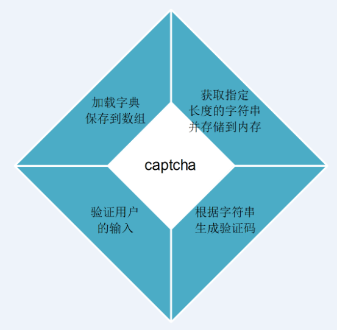
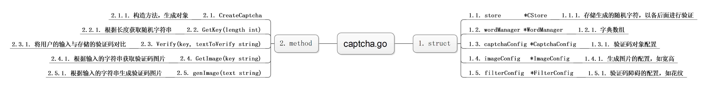
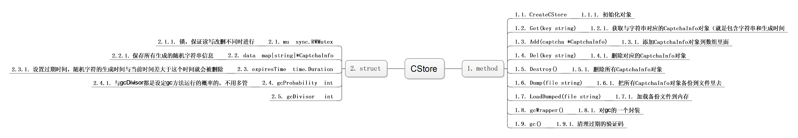

##  Go语言学习之验证码服务实现原理

昨晚在github上偶遇这个项目，[gocaptcha](https://github.com/hanguofeng/gocaptcha)，一个用Go语言实现的验证码服务器。看了下代码量，不是很大，正好适合我学习，而且我也很想知道验证码这东西到底是怎么个实现过程。

下面的讲解将主要围绕验证码这一块，服务器那一块暂时搁置一下。下图是验证码生成过程的四个主要部分：

首先看第一个部分，加载字典这一块。gocaptcha提供了两种字典模式，一个是以词语一行的，一个是单字一行。这里没很明白为什么要提供后者，因为前者就能提高后者的需求了。因此，我下面将精简源代码的部分，只关注于加载词语型的字典。

要加载的字典文件位于data文件夹内，即是cn_phrases文件。打开看就知道每行都是一个词语。下面就是读取和存储的过程代码：

    //LoadFromFile is the loader func of word manager
    func (mgr *WordManager) LoadFromFile(filename string) error {
	mgr.words = []string{} //表示空的字符串数组
	f, err := os.Open(filename)
	if nil != err {
		panic("file not readable:" + err.Error())
	}
	defer f.Close()
	reader := csv.NewReader(f)

	//下面这句可以不管，它是用来判断用的是那种词典的，咱们这里永为true
	mgr.isDataSingleChar = true
	for {
		record, err := reader.Read()

		if err == io.EOF {
			break
		} else if nil != err {
			return err
		}

		if 1 < len([]rune(record[0])) {
			mgr.isDataSingleChar = false
		}
		//record是一个数组，而这里只有一个元素
		mgr.words = append(mgr.words, strings.TrimSpace(record[0]))
	}

	log.Printf("Load Complete,totle : %d,isDataSingleChar:%s", len(mgr.words), mgr.isDataSingleChar)

	return nil
    }

读取完字典文件之后，下一步就是生成随机字符串。在生成随机字符前，还要进行一系列配置的设定，如下函数就是进行配置并返回相应的配置。captchaconfig是对后面要生成的captcha对象进行配置的，imageconfig这是对图片进行配置，如宽高。而filterconfig则是对障碍干扰进行配置，如花纹形态等。

    func loadConfig() (*CaptchaConfig, *ImageConfig, *FilterConfig) {

	//生成CaptchaConfig
	captchaConfig := new(CaptchaConfig)
	captchaConfig.CaptchaLifeTime = 10 * time.Second //验证码从生成字符串到用户输入验证的有效周期
	captchaConfig.GcProbability = 1
	captchaConfig.GcDivisor = 100 //过期验证码的回收概率(GcProbability/GcDivisor)

	//生成ImageConfig
	imageConfig := new(ImageConfig)
	imageConfig.FontFiles = []string{
		"c:/windows/fonts/SIMLI.TTF",
		"c:/windows/fonts/simfang.ttf",
		"c:/windows/fonts/SIMYOU.TTF",
		"c:/windows/fonts/msyh.TTF",
		"c:/windows/fonts/simhei.ttf",
		"c:/windows/fonts/simkai.ttf"} //验证码的字体文件，会每个字随机的使用这些字体
	imageConfig.FontSize = 26 //字号
	imageConfig.Height = 40   //生成的图片高度(px)
	imageConfig.Width = 120   //生成的图片宽度(px)

	//生成FilterConfig
	filterConfig := new(FilterConfig)
	filterConfig.EnableNoiseLine = true   //启用干扰线
	filterConfig.EnableNoisePoint = false //启用噪点
	filterConfig.EnableStrike = false     //启用波形干扰
	filterConfig.StrikeLineNum = 3        //波形干扰数目
	filterConfig.NoisePointNum = 30       //噪点数目
	filterConfig.NoiseLineNum = 10        //干扰线数目

	return captchaConfig, imageConfig, filterConfig
    }

下一步则是要生成一个captcha对象，来进行字符串生成，图像生成以及验证等功能，下面是初始化代码：

    //生成验证码处理对象
	captcha := CreateCaptcha(wordmgr, captchaConfig, imageConfig, filterConfig)

有必要通过一幅图来说明一下captcha对象的结构，或者说captcha.go这份源代码的结构，如下：

如果图片看不清，可以下载下来放大看的。
GetKey方法可以获取到随机的字符串，该方法内部其实就是通过wordManager.Get(length)来获得随机字符串，然后增加时间等数据，构成CaptchaInfo对象，存储到内存里。获取随机字符的实现也简单，如下，根据字典数组长度生成一个随机数，然后获取对应的词语就可以了：

       func (mgr *WordManager) getLine() string {
    	maxIndex := len(mgr.words) - 1
    	rstIndex := rnd(0, maxIndex)
    	rst := mgr.words[rstIndex]
    
    	return rst
    }

生成了随机字符之后，还有一个重要的一步就是把生成后的字符以及生成时间构成CaptchaInfo对象存储起来。下面来看看store.go里面的代码是怎么实现存储和更新的，先来看结构图：

有了上面的结构图，再配合一下代码，你应该马上就能看懂了。

下面进入第三部分：验证码图片的生成。

生成图片的代码就是captcha.go里面的genimage方法（看上上个结构图），如下：

    func (captcha *Captcha) genImage(text string) *CImage {

	cimg := CreateCImage(captcha.imageConfig)
	cimg.drawString(text)

	if captcha.filterConfig.EnableStrike {
		cimg.strikeThrough(captcha.filterConfig.StrikeLineNum)
	}

	if captcha.filterConfig.EnableNoisePoint {
		for i := 0; i < captcha.filterConfig.NoisePointNum; i++ {
			cimg.drawCircle(rnd(0, captcha.imageConfig.Width), rnd(0, captcha.imageConfig.Height), rnd(0, 2), uint8(rnd(1, colorCount)))
		}
	}

	if captcha.filterConfig.EnableNoiseLine {
		for i := 0; i < captcha.filterConfig.NoiseLineNum; i++ {
			x := rnd(0, captcha.imageConfig.Width)
			cimg.drawHorizLine(int(float32(x)/1.5), x, rnd(0, captcha.imageConfig.Height), uint8(rnd(1, colorCount)))
		}
	}

	return cimg
    }

从这段代码来看，主要实现图片生成的，是CImage，而CImage主要用到了go语言的image库。所以关于怎么生成图片的部分就讲到这吧，因为继续深入的内容，就要从学习image库开始了。但我们已经知道了图片是用什么方式生成出来的了。

最后一个部分是验证用户输入，代码如下：

    func (captcha *Captcha) Verify(key, textToVerify string) (bool, string) {
	info := captcha.store.Get(key)
	if nil == info {
		return false, "captcha info not found"
	}

	if info.CreateTime.Add(captcha.captchaConfig.CaptchaLifeTime).Before(time.Now()) {
		return false, "captcha expires"
	}

	if info.Text != textToVerify {
		return false, "captcha text not match"
	}
	captcha.store.Del(key)
	return true, ""

	return false, "not reachable"
    }

第一个key是图片中的文字，第二个textToVerify这是用户的输入。这样要做的，就是看当前key是否还存在于store中，如果有，过期了没，如果这两个条件符合，而且两者是一样的，就说明用户输入正确。同时在内存里把这个验证码删除掉。

主要的内容现在都讲完了，如果明天有时间，我会学习一次CImage的详细代码。