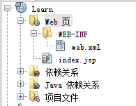
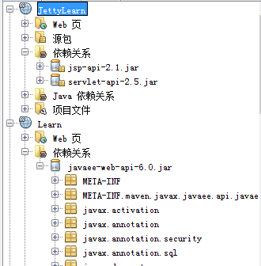

## Jetty 9 在Netbeans平台上配合Maven开发Web应用过程

为何我会花那么多时间弄在Netbeans使用Maven基于Jetty开发应用呢？一个是我真心喜欢用Netbeans写代码，一个是我小众技术爱好的性格所致。而最重要的一点，Jetty和Maven开发Web应用，预先提供的东西都非常少，连Web.xml配置文件都没有提供。这样的好处对于学习是非常大的，这样我就能够知道每个配置文件的作用，每个配置语句的作用。

使用的话，可以看上一篇关于Jetty的介绍：[《在Netbeans中使用Jetty进行Web项目的开发》](http://www.shahuwang.com/2013/08/26/%e5%9c%a8netbeans%e4%b8%ad%e4%bd%bf%e7%94%a8jetty%e8%bf%9b%e8%a1%8cweb%e9%a1%b9%e7%9b%ae%e7%9a%84%e5%bc%80%e5%8f%91.html) 。不过这里，我使用的是Jetty 9.0，所以配置有些许不同。在pom.xml里增加配置如下：

    <plugin>
     <groupId>org.eclipse.jetty</groupId>
        <artifactId>jetty-maven-plugin</artifactId>
        <version>9.0.5.v20130815</version>
        <configuration>
        <scanIntervalSeconds>10</scanIntervalSeconds>
     </configuration>
    </plugin>

这里，采用的是9.0.5版本的Jetty，scanIntervalSeconds表示的是Jetty每隔 10 秒对Web应用进行一次扫描，看看是否有代码更改。

然后，在 settings.xml 增加配置如下：

    <pluginGroups>
        <pluginGroup>org.eclipse.jetty</pluginGroup>
    </pluginGroups>

记住，要使用 JDK 7才能运行Jetty 9 。

如何配置运行和debug就和上面那篇文章里提到的一样了。（后面可能会增加一些不一样的配置，敬请期待后面博客的更新）

现在要增加web.xml 配置文件，没有这个文件可不行。如下图

 

在Web页目录下建立文件夹，名为WEB-INF，然后在里面建立 web.xml，建立之后由于是空的，所以先增加如下内容：

    <?xml version="1.0" encoding="UTF-8"?>
      <web-app version="2.5" xmlns="http://java.sun.com/xml/ns/javaee" xmlns:xsi="http://www.w3.org/2001/XMLSchema-instance" xsi:schemaLocation="http://java.sun.com/xml/ns/javaee http://java.sun.com/xml/ns/javaee/web-app_2_5.xsd">
        <session-config>
            <session-timeout>
                30
            </session-timeout>
        </session-config>
    <welcome-file-list>
        <welcome-file>index.jsp</welcome-file>
    </welcome-file-list>
    </web-app>
 

这里配置session-timeout的时间为 30 分钟，注意是分钟。因为正常情况下都是秒的，而这里的确实分钟。

welcome-file-list 用来配置一系列的首页页面。就是说你访问 http://www.shahuwang.com 的效果和http://www.shahuwang.com/index.php 效果是一样的，welcome-file-list就是用来配置这个的。之所以要是list，看到的说法是如果第一个welcome-file没有找到，就用第二个。要注意的是，这个welcome-file只能用一个存在Web页文件夹下的文件。你不能用一个servlet来做welcome-file 。

使用Netbeans创建 Java EE 5 Java EE 6 Web两种项目，所产生的依赖差别很多。如下图：

上面的是 Java EE 5，下面的是 Java EE 6 ,不知道为啥 Java EE 6 要把所有的包都放进来了。这样导致 生成的War 包得多大呀。另外的一个问题是，Jetty 支持 Java EE 6吗？

其实至今我对Java EE还很不了解。它太庞大了，以至没有书籍可以入门。而公司现在用的是Glassfish 3，它内置了非常多的Java EE支持，导致我写的代码都分不清那些是Java EE的东西了。

从上图来看，Java EE 6 比 Java EE 5方便了很多，不需要去添加那么多的jar包了。Jetty 9也开始支持 Servlet 3 了，所以应该是能运行 Java EE 6的吧。

现在我们用的是Jetty的Maven的插件，基本上只包含Jetty的jar包，而不包括配置文件等很多东西。所以，去下载一个同版本的jetty，因为要利用到里面的配置问题。然后把里面的etc文件夹里的所有文件都复制出来。然后在pom.xml 里进行如下配置：

    <configuration>
           <scanIntervalSeconds>10</scanIntervalSeconds>
           <jettyConfig>${project.basedir}/src/main/resources/etc/jetty.xml</jettyConfig>
     </configuration>

这里是把所有的配置文件，都放到src/main/resources/etc里了。你按照着路径创建文件夹就可以了。

但是如果要读取多个配置文件呢？就如下面这样：

     <jettyXml>
         ${project.basedir}/src/main/resources/etc/jetty.xml,${project.basedir}/src/main/resources/etc/jetty-http.xml
      </jettyXml>

上面的jettyXml标签，换成 jettyConfig也是可以的。但是有个问题，它们都是用逗号分割两个文件的。像上面这样写的文件路径比较长，如果有多个，不换行不行。但是换行maven读取就出错，所以目前不能换行，看来需要找到个方式看看如何把路径缩短了。

今天太累了，就写到这了。明天继续，努力就会有希望的！

