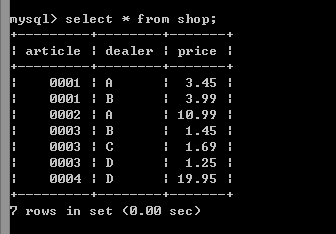
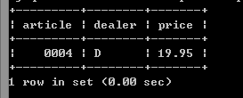
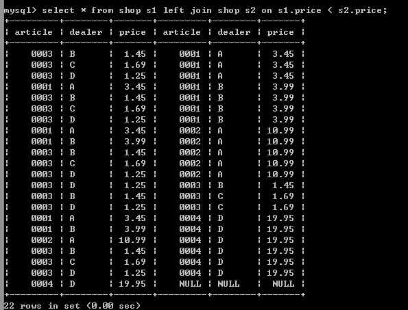

## MySQL的left join

嗯，写文章之前，还是照例来一小段评论吧。

最近比较火的一条新闻是Mongodb获得了上千万的融资，估值达到十亿美元了。而开源公司里，Redhat达到这个市值花了将近20年的时间。

对于这条消息，该怎么说呢。首先吧，一个是钱的面值变大了。再怎么说，现在的100美元也没有九十年代的100美元值钱。另外呢，大数据这个概念炒得真是火呀，现在说起大数据，没有Hadoop，Mongodb，好像就不是在搞大数据了。所以，这里的泡沫真是大呀。

我好像是2010年的时候，才第一次从《程序员》杂志上看到NoSQL这东西的，年少无知的我，看了上面的介绍，也觉得NoSQL要拯救世界了。但越到后面，我接触的越多，就发现，NoSQL也就那样。很多工作在互联网公司的程序员会说NoSQL要统治世界了，但实际上，这东西，至少目前来说，真的没有关系数据库重要。也因此，我基本上没有花时间去了解这些东西，当然，我数据库方面的学习本来就非常欠缺，罪过罪过，这一年里要尽量补过。

好了，来说说今天为什么要写这篇文章。

今天我在看MySQL那厚厚的四千多页的文档，看到198页的一个例子，例子里用三种方法获得数据表里面的最大值，有一个是使用 left join实现的，让我非常看不懂，因此就搜索了下，看了几个人写的博客，搞明白了个大概。

首先，你先创建一个数据库，或者使用当前已有的数据库，创建如下表：

    CREATE TABLE shop (
    article INT(4) UNSIGNED ZEROFILL DEFAULT '0000' NOT NULL,
    dealer CHAR(20) DEFAULT '' NOT NULL,
    price DOUBLE(16,2) DEFAULT '0.00' NOT NULL,
    PRIMARY KEY(article, dealer));

然后插入一些示例数据，如下：

    INSERT INTO shop VALUES
    (1,'A',3.45),(1,'B',3.99),(2,'A',10.99),(3,'B',1.45),
    (3,'C',1.69),(3,'D',1.25),(4,'D',19.95);

执行：

    select * from shop;

可以看到如下的结果：

此时，如果我们想获得price最高的那一列数据，记住，不是price最高是多少，而是price最高所在的那列的数据，要怎么写sql呢？其中一种简单的方法如下：

    select * from shop where price=(select max(price) from shop);

获得的结果如下：

还有另一种更加简单的方法就是使用limit关键字。如下：

    select * from shop order by price desc limit 1;

上述两种方法，稍微学习过SQL的人，都很容易明白意思，然而下面这种方式，就比较困难了：

    select s1.* from shop s1 left join shop s2 on s1.price < s2.price
    where s2.article is null;

同样可以得到上图中的结果，这到底是为什么呢？ 这两篇博客可以让我们多少了解清楚上述SQL到底做了什么：[MYSQl left join 联合查询效率分析](http://www.ccvita.com/90.html) ，以及 [关于 MySQL LEFT JOIN 你可能需要了解的三点](http://www.oschina.net/question/89964_65912) 。

下面我来自己解释一下：

首先，on 条件语句，是对右表的过滤，上述语句中就是对s2的过滤。left join的执行过程是这样的，首先，从左表中拿出一条数据，然后根据on条件语句，到右边中取出符合条件的数据，把两个拼接起来，组成一个在内存里的新表。注意，这里有个过程，比如咱们这里是左表右表都是同一个表，从左表取出一条数据之后，其实是会从右表中取出所有的符合条件的数据，拼接。然后再从左表取下一条数据，再次从右表中取出所有符合条件的数据，拼接，递归下去，形成一个新表。然后，where语句再对这个新表进行一次过滤，过滤完毕就是展现在我们眼前的样子了。

所以，上述语句，就是先从原表里取出一条数据A，然后再回原表，取满足B.price > A.price的数据，然后继续，左表继续取下一条，然后再回原表，取满足B.price > A.price的数据 。最后，这个过程的结果拼接为一个新表，再用where语句进行过滤。

也许说完这些，你还看不怎么懂，没关系，我稍微修改下上述的SQL语句：

    select * from shop s1 left join shop s2 on s1.price < s2.price;

生成的结果如下：

之前那条语句，并没有把所有查询到的字段都展示出来，这次把所有字段都展示出来，并把where语句去掉，展示出结果之后 ，对之前那条语句是不是一下子就明白了呢？
    
说实在的，这句

    select s1.* from shop s1 left join shop s2 on s1.price < s2.price
    where s2.article is null;

真的是很好的利用了left join的特性的。price值最大的那个数据，一定不满足 s1.price<s2.price，所以右表中肯定没有符合on条件的数据，根据left join的原则，它只能是null了。通过where条件，就挑出了最大值所在的列。

