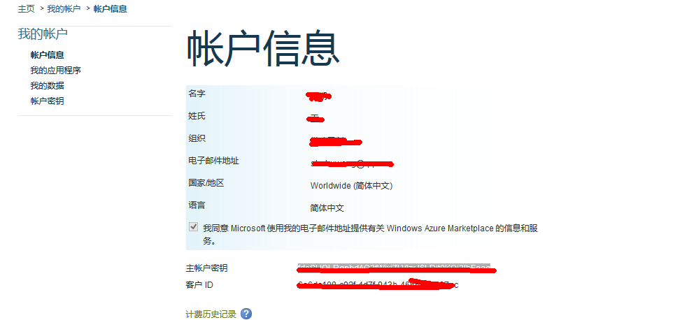

##  微软Bing翻译API的使用

不得不说，大公司就是大公司，养的人吧，能把界面做的很好，能把文档的文字写得很多，但是就是不会把文档写好组织好服务好开发者。2011年它的API已经变了，特么官方所有的文档还介绍的是以前的那个API。而现在变成oAuth调用的文档也有，但不多。两个时期的文档都放在网上，还混在一起，这是要闹哪样啊。

另外，有些地方可以让你创建应用。但是每次关了那个页面之后，我就不知道他们的开发者中心到底是怎么弄的，折腾了我整整一天的时间。最后还是普通开发者好，有个人知道微软文档的恶心，所以做了个java类库，直接让你输入client id和secret就可以进行翻译了。

首先，可以到[http://code.google.com/p/microsoft-translator-java-api/](http://code.google.com/p/microsoft-translator-java-api/)这里下载Java类库。它有两种类型，一个是包含所有依赖的，一个是不包含依赖的。我下载的是包含依赖的，方便好用。

然后，在到这里[https://datamarket.azure.com/account](https://datamarket.azure.com/account) 取得你的clientid和secret。当然，前面你会经过一系列的注册登陆等流程。弄好之后，再点击这个页面就能看到如下的东西了：

上图中的“主帐户密钥”和“客户 ID”就是我们要的了。

然后按照那个翻译Java类库的代码，把id和密钥填入，如下，就能实现翻译了：

    import com.memetix.mst.language.Language;
    import com.memetix.mst.translate.Translate;
    
    public class Main {
      public static void main(String[] args) throws Exception {
    // Set your Windows Azure Marketplace client info - See http://msdn.microsoft.com/en-us/library/hh454950.aspx
         Translate.setClientId(/* Enter your Windows Azure Client Id here */);
         Translate.setClientSecret(/* Enter your Windows Azure Client Secret here */);
    
         String translatedText = Translate.execute("Bonjour le monde", Language.FRENCH, Language.ENGLISH);
    
        System.out.println(translatedText);
      }

