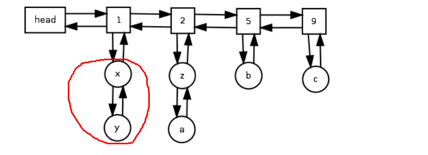
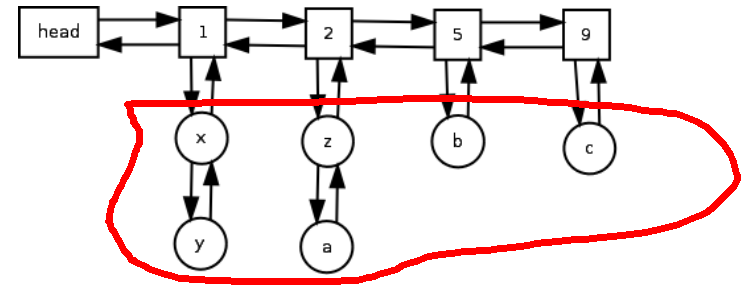

## 计算复杂度为O(1)的LFU算法

今天微博上，关于Go语言又吵起来了。总的来说，就是走学院派路线的人都很看不上Go，走实践派路线的，都觉得Go是个很有潜力的语言。 
 
他们整天都在谈编译器等高级话题，我这种连《编译原理》都没有看过的人，表示只能沉默了。
  
不管其他人怎么去说Go不好，至少对于我来说，对于我这个连C语言都不会的人来说，Go很好。在我学习编程的道路上，Go之前有两门语言对我起到了很大的作用，第一个是Python，是它让我喜欢上编程的。第二个是Java，是它让我对面向对象有了初步的认识，也是这门语言做了我第一个作品。

Go语言它有结构体，有指针，对于实现数据结构和算法非常方便，而且能和很多的基于C/C++的很好结合起来，又省却了C/C++各种难懂的东西。

在用Go之前，我真的对数据结构和算法很没有感觉的，大学唯一挂科的也是数据结构和算法这门课。但是用了Go之后，我真的很喜欢用它来实现一些数据结构和算法，也很喜欢看这方面的源代码。

今天学习的算法是LFU（Least Frequently Used）算法，简单的简介看这篇文章就可以了：[
《缓存淘汰算法系列之2——LFU类》 ](http://blog.csdn.net/yunhua_lee/article/details/7648549) 。

该算法是根据数据的历史访问频率来淘汰数据，其核心思想是“如果数据过去被访问多次，那么将来被访问的频率也更高”。因此，首先就得对每个要被访问的数据进行计数。

谈到算法的时候，有一点是很容易误解的，即很多人会以为算法会有明确的定义，有非常详细的定义，实现过程也是比较唯一的。但其实不是这样的，LFU主要就描述了如下三个特征：  

1. 新加入数据插入到队列尾部（因为引用计数为1）；

2. 队列中的数据被访问后，引用计数增加，队列重新排序；

3. 当需要淘汰数据时，将已经排序的列表最后的数据块删除。 一般是把访问次数为1 的都删除掉。

除去这三个特征，还有很多细节以及实现方式，各家在自己实现的时候都有所不同。

传统上，LFU算法时常使用最小堆和hash表来实现，由于每一次的数据的改变，最小堆变化的操作过程都是O(logn)，hash表碰撞处理的时间是O(1),所以这种方式下的LFU算法效率为O(logn)。

昨天在Github上看到这份代码[https://github.com/dgrijalva/lfu-go](https://github.com/dgrijalva/lfu-go)，作者参考这篇论文[http://dhruvbird.com/lfu.pdf](http://dhruvbird.com/lfu.pdf) ，用Go语言实现了这篇论文里提到的LFU算法实现。该方式下，LFU算法的效率为O(1)，非常快。

下面的文章主要是先解读这篇论文提到的实现方式 ，然后解读代码。

论文提到的方式里，首先用一个双向链表保存频率数据节点，比如保存1,2,3,4这样的频率数据节点。然后再用一个hash表保存所有要访问的数据，这样的话，查询操作在获取结果这一步直接get，效率为O（1）。然后，再用一个集合，每个频率节点对应一个集合，集合里面的数据都是访问频率相同的。且集合里面的数据都是node，都有一个指向该频率节点的指针。下图是作者文章的原图：

如上图，正方形格子就是频率节点，形成双链表。圆形的则是具有同样访问频次的数据节点。但我觉得作者画的图好像有问题，我画红线的地方，作者说这里也是一个链表（整篇文章说这个算法就是利用两个双链表形成O(1)效率的），但实际上最后的伪代码里，这里不是个链表，而是一个集合。看github上那份代码，红线部分直接用hash表了。

暂时先不管了这个纠结了。首先来看怎么初始化：

+ 程序要访问数据y，数据y被提到内存里了
+ 因为第一次访问，所以访问频率是1，创建一个频率节点，值为1，head指针指向它
+ y 构建成一个规定结构的node，并把其指针指向频率节点 1
+ y这个节点存放到全局的hash表了（图上没有画出来），供检索使用

初始化完毕后，第二步是关于如何add数据的：

+ 根据数据构建节点
+ 和初始化差不多的方式添加节点，节点放到链表的头部
+ 判断节点总数是否超过了阈值，如果超过了，进行驱逐，使得总数少于阈值

第三步是关于查询数据的：

+ 根据一个key，到全局hash表里获取这个数据节点，比如说是y
+ 由于y被多访问了一次，此时其访问频率增加了1，于是要进行位置更替
+ 访问前，y的访问频率是1,访问后变成了2 。
+ 找到y对应的频率节点 1，看看其next指针。如果指向为空，则创建一个新的频率节点 2，把y移到频率节点2下，同时删除频率节点1下的那个。如果指向不为空，看看其指向频率节点的值是否为2，如果是，则直接移动。如果不是，则要创建一个频率节点2，然后再移动

第四步是关于删除数据的：

+ 把频率节点1下的数据都删除掉
+ 把hash表里的对应节点都删除掉

论文解说完毕，现在来看代码。首先作者提供了三个结构体，第一个如下：

     type Cache struct {
    	// If len > UpperBound, cache will automatically evict
    	// down to LowerBound.  If either value is 0, this behavior
    	// is disabled.
    	UpperBound int
    	LowerBound int
    	values map[string]*cacheEntry
    	freqs  *list.List
    	len int
    	lock   *sync.Mutex
    }

这个结构体就是整个LFU算法的结构体（可能这样说不是很明白），upperBound是数量的上限，lowerBound则是数量的阈值，就是说数量超过上限时，自动把数量删减到lowerBound。values保存了所有的数据节点。freqs就是频率节点链表。

第二个则是数据节点，就是上图中的x，y。。。：

    type cacheEntry struct {
    	key  string
    	value interface{}
    	freq Node *list.Element
    }

第三个则是集合部分的结构体：

    type listEntry struct {
    	/*
    	 这个结构体是存储实际值的列表
    
    	*/
    	entries map[*cacheEntry]byte //
    	freq int
    }

就是下图红线中的数据集合的结构体，如x和y就是这个结构体里面的一部分：

可以看出，代码作者这里直接使用hash表来保存图中本来说的链表来实现。

初始化代码如下，没什么好说的：

    func New() *Cache {
    	c := new(Cache)
    	c.values = make(map[string]*cacheEntry)
    	c.freqs = list.New()
    	c.lock = new(sync.Mutex)
    	return c
    }
    
查询数据代码如下：

    func (c *Cache) Get(key string) interface{} {
    	c.lock.Lock()
    	defer c.lock.Unlock()
    	if e, ok := c.values[key]; ok {
    		c.increment(e)
    		return e.value
    	}
    	return nil
    }
从上面可以看出，是直接从全局hash表里面获取数据的。这里最重要的是increment，这个方法做了很多事情，这里是频率改变后的移动换位操作，涉及内容比较多，不管增删改查，都需要调用这个方法，也就导致了这个方法的功能或者说目的很不单纯，使得代码阅读起来相当让人纠结。这就涉及到工程上的trade-off了，到底是减少代码量呢，还是增加代码量，使得每个方法的目的更单纯呢？要是我会选择后者。  

    func (c *Cache) increment(e *cacheEntry) {
	currentPlace := e.freqNode
	var nextFreq int
	var nextPlace *list.Element
	if currentPlace == nil {
		// new entry
		nextFreq = 1                //频率
		nextPlace = c.freqs.Front() //要挂科的链表的位置，这里是头部
	} else {
		// move up

		nextFreq = currentPlace.Value.(*listEntry).freq + 1
		nextPlace = currentPlace.Next()
	}

	//
	if nextPlace == nil || nextPlace.Value.(*listEntry).freq != nextFreq {
		// create a new list entry
		li := new(listEntry)
		li.freq = nextFreq
		li.entries = make(map[*cacheEntry]byte)
		if currentPlace != nil {
			//把新的桶放到当前桶的后面，因为freq只增加了1
			nextPlace = c.freqs.InsertAfter(li, currentPlace)

		} else {
			//插入到头部去
			nextPlace = c.freqs.PushFront(li)
		}
	}
	e.freqNode = nextPlace
	//把e放进nextplace的桶里。
	//实际上作者用了一个链表，两个hash表，一个hash表用户get数据，保证数据
	//链表保存频率值，另一个hash表保存具有同样频率的cacheEntry
	//下面这句就是把当前的cacheEntry放到这个hash表里（桶）
	//与http://dhruvbird.com/lfu.pdf 的定义还不太一样
	//这里进行了类型断言，但估计这里是乱用的
	nextPlace.Value.(*listEntry).entries[e] = 1
	if currentPlace != nil {
		// remove from current position
		c.remEntry(currentPlace, e)
	}
    }

首先来分析下各个主要变量的意思，e表示一个数据节点，就像上图中的x，y这些。currentPlace表示e指向的频率节点，就是方框1,2,3这些。nextFreq表示e即将要变成的频率。nextPlace自然就是e要迁往处对应的频率节点啦。

    if currentPlace == nil {
		// new entry
		nextFreq = 1                //频率
		nextPlace = c.freqs.Front() //要挂科的链表的位置，这里是头部
	} else {
		// move up

		nextFreq = currentPlace.Value.(*listEntry).freq + 1
		nextPlace = currentPlace.Next()
	}

上面这一段，currentPlace==nil，这里是判断这个数据节点是新加入的，还是原有，只是频率改变而交换的。如果是新加入，频率是1，要插入的位置为双链表的头部。如果是原有的，则频率加1,注意 currentPlace.Value.(*listEntry).freq 这里用到了类型断言的功能。最让我困惑的就是nextPlace，也就是currentPlace.Next()这里了。由于之前对Go的List不太了解，困惑了许久。currentPlace的类型是*list.Element, Next能获取到当前节点的下一个节点。比如上图中，1的next是2. 当然，这里有可能为nil。

接下来的是这一段代码：

    if nextPlace == nil || nextPlace.Value.(*listEntry).freq != nextFreq {
		// create a new list entry
		li := new(listEntry)
		li.freq = nextFreq
		li.entries = make(map[*cacheEntry]byte)
		if currentPlace != nil {
			
			nextPlace = c.freqs.InsertAfter(li, currentPlace)

		} else {
			//插入到头部去
			nextPlace = c.freqs.PushFront(li)
		}
	}

如果nextPlace==nil，说明不存在这个频率节点。比如原来是5的，加1变成了6,双链表上并没有6，所以就要增加一个新的频率节点了。至于什么条件下会要判断 nextPlace.Value.(*listEntry).freq != nextFreq，没搞明白。

上面这段代码创建了一个集合，或者说桶。如果你学习过桶排序，应该挺容易明白的。因为新增加了一个不存在的频率节点，所以也要创建一个对应的桶来装数据节点。

currentPlace != nil 这个判断也是判断当前节点是新增加的，还是原有的。新增加的节点为nil。

这个方法看明白了，其他的也就很容易看明白了。不过到现在我还不是特别清晰的明白，功力不够呀